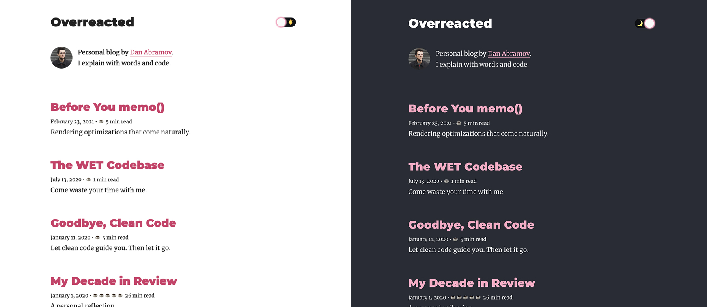

<h1 align="center">
    
</h1>

<p align="center">
  <a href="#-technologies">Technologies</a>&nbsp;&nbsp;&nbsp;|&nbsp;&nbsp;&nbsp;
  <a href="#-layout">Getting started</a>&nbsp;&nbsp;&nbsp;|&nbsp;&nbsp;&nbsp;
  <a href="#-project">Project</a>&nbsp;&nbsp;&nbsp;|&nbsp;&nbsp;&nbsp;
  <a href="#-layout">Layout</a>&nbsp;&nbsp;&nbsp;|&nbsp;&nbsp;&nbsp;
  <a href="#-license">License</a>
</p>

<p align="center">
  
  
  

  
</p>

<br>

<p align="center">
  
</p>

## 🧪 Technologies

This project was developed using the following technologies:

- [React](https://reactjs.org)

## 🚀 Getting started

Clone the project and access the folder

```bash
$ git clone https://github.com/JorgeFPeres/Dark-Theme.git && cd Dark-Theme
```

Follow the steps below

```bash
# Install the dependencies
$ npm install

# Start the project
$ npm start
```

## 💻 Project

This is a project inspired in the website **[Overreacted](https://overreacted.io/)**, from **@Dan Abramov**.

Visite the site to see a great content of React creat by Dan.

## 🔖 Layout

You can view the project layout through the links below:

- [Layout Web](https://overreacted.io/)

## 📝 License

This project is licensed under the MIT License. See the [LICENSE](LICENSE.md) file for details.

---

<p align="center">Made with ❤️ by Jorge F Peres</p>
